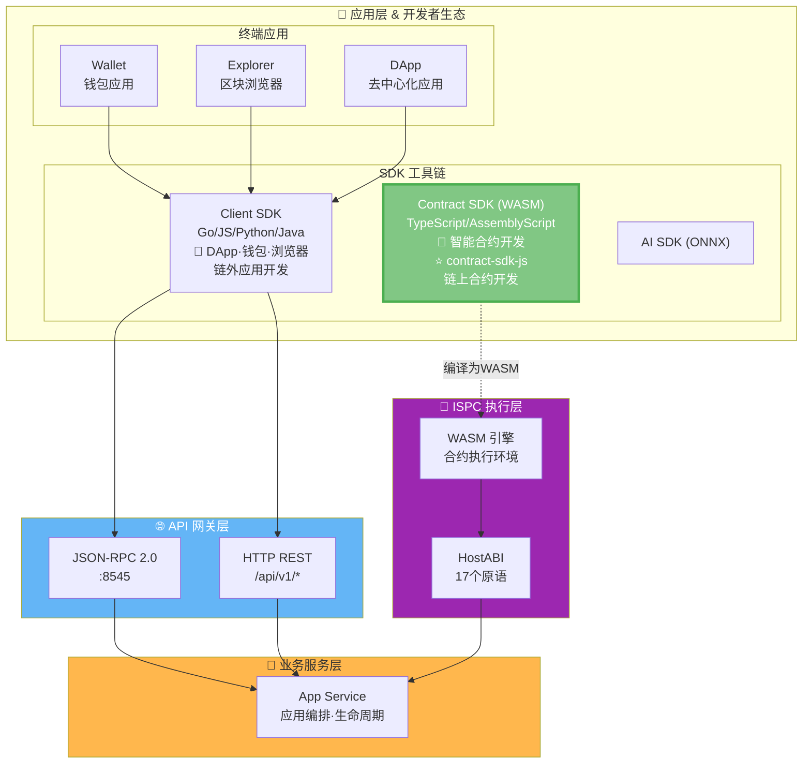
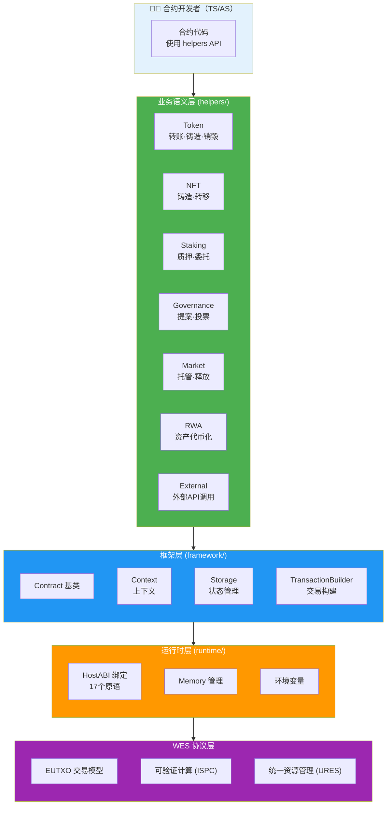

# WES Smart Contract SDK for JavaScript/TypeScript

<div align="center">

<pre>
__          ________ _____  _______     ___   _ 
\ \        / /  ____|_   _|/ ____\ \   / / \ | |
 \ \  /\  / /| |__    | | | (___  \ \_/ /|  \| |
  \ \/  \/ / |  __|   | |  \___ \  \   / | . ` |
   \  /\  /  | |____ _| |_ ____) |  | |  | |\  |
    \/  \/   |______|_____|_____/   |_|  |_| \_|
</pre>

**WES 区块链智能合约开发工具包 - JavaScript/TypeScript 版本**  
**为智能合约开发者提供业务语义优先的合约开发能力**

[](https://www.npmjs.com/package/@weisyn/contract-sdk-js)
[](LICENSE)
[](https://www.typescriptlang.org/)
[](https://www.assemblyscript.org/)

[🚀 快速开始](#-快速开始) • [🎨 合约模板](#-合约模板) • [💡 核心能力](#-核心能力) • [🏗️ 架构概览](#-架构概览) • [📚 文档导航](#-文档导航)

</div>

---

## 🌟 它能帮你做什么？

在传统区块链开发中，开发者需要：
- ❌ 理解底层协议细节（UTXO、交易构建、签名等）
- ❌ 手动构建交易（选择输入、创建输出、计算手续费）
- ❌ 处理复杂的业务逻辑组合（转账、授权、质押等）

**WES 智能合约 SDK 让这一切成为过去**：

- ✅ **业务语义优先** - 提供 `Transfer()`、`Mint()`、`Stake()` 等直观的业务接口
- ✅ **TypeScript/AssemblyScript** - 使用熟悉的语言编写合约
- ✅ **WASM 优化** - 专为 AssemblyScript WASM 编译优化，合约体积小、执行快
- ✅ **企业级能力** - 支持外部系统集成、长事务、复杂业务逻辑
- ✅ **类型安全** - 完整的类型定义和编译期检查，减少运行时错误

---

## 🚀 快速开始

### 前置要求

- **Node.js 20+** - 用于开发环境
- **TypeScript 5.0+** - 用于类型检查
- **AssemblyScript 0.27+** - 用于编译到 WASM

```bash
# 安装 AssemblyScript
npm install -g assemblyscript

# 验证安装
asc --version
```

### 安装 SDK

```bash
npm install @weisyn/contract-sdk-js
```

在 `package.json` 中：

```json
{
  "dependencies": {
    "@weisyn/contract-sdk-js": "^1.0.0"
  }
}
```

### 第一个合约

创建 `hello.ts`:

```typescript
import { Contract, Context, ErrorCode } from '@weisyn/contract-sdk-js/as';

@contract('HelloWorld')
export class HelloWorldContract extends Contract {
  onInit(params: Uint8Array): ErrorCode {
    return ErrorCode.SUCCESS;
  }
  
  @call('SayHello')
  sayHello(): ErrorCode {
    const caller = Context.getCaller();
    const message = `Hello, ${caller}`;
    this.emitEvent('Greeting', String.UTF8.encode(message));
    this.setReturnData(String.UTF8.encode(message));
    return ErrorCode.SUCCESS;
  }
}
```

### 使用业务语义接口

**推荐方式**：使用 `helpers` 层的业务语义接口：

```typescript
import { Token } from '@weisyn/contract-sdk-js/helpers';
import { Context, ErrorCode } from '@weisyn/contract-sdk-js/as';

@call('Transfer')
transfer(): ErrorCode {
  const params = Context.getContractParams();
  const toStr = params.parseJSON('to');
  const amount = params.parseJSONInt('amount');
  
  const to = Context.parseAddressBase58(toStr);
  if (to === null) {
    return ErrorCode.ERROR_INVALID_PARAMS;
  }
  
  const caller = Context.getCaller();
  const result = Token.transfer(caller, to, amount, null);
  if (result !== ErrorCode.SUCCESS) {
    return ErrorCode.ERROR_EXECUTION_FAILED;
  }
  
  return ErrorCode.SUCCESS;
}
```

### 编译合约

```bash
# 使用 AssemblyScript 编译器
asc hello.ts --target release --outFile hello.wasm
```

> 📖 **完整指南**：[开发者指南](./docs/DEVELOPER_GUIDE.md) | [合约模板](./templates/README.md)

---

## 🎨 合约模板

`contract-sdk-js` 内置了大量按业务场景分类的合约模板，帮助你在统一的业务语义与最佳实践下快速落地：

- **学习模板 (`templates/learning/`)**
  - `hello-world`：最小可运行合约，熟悉调用入口、返回码与事件
  - `simple-token`：基础可转账代币，实现 `Transfer` 等常见操作
  - `basic-nft`：简单 NFT 发行与转移
- **标准业务模板 (`templates/standard/`)**
  - `token/`：多种代币形态（可分/不可分、白名单、权限控制等）
  - `staking/`：质押、解押、收益分配等 Staking 场景
  - `governance/`：提案、投票、治理流程模板
  - `market/`：托管、分阶段释放（vesting）、撮合等市场场景
  - `nft/`：多种 NFT 发行、拍卖、交易场景
  - `rwa/`：实物资产上链与代币化模板
  - `defi/`：AMM、借贷、流动性池等 DeFi 场景

**如何使用模板（通用步骤）**：

1. 进入目标模板目录，例如：

   ```bash
   cd templates/learning/simple-token
   ```

2. 阅读当前目录下的 `README.md`，根据说明完成依赖安装与环境准备  
3. 根据模板提供的构建脚本或文档使用 AssemblyScript 编译为 WASM  
4. 在 WES Workbench（如 `contract-workbench` 或 `model-workbench`）中导入生成的 WASM 与 `metadata.json` 完成部署与测试

> 📖 **模板总览与场景说明**：详见 [模板中心](./templates/README.md)  
> 📌 **模板对齐**：TS/AS 模板与 Go 模板在业务场景上一一对应，保证同一业务场景下行为一致

---

## 💡 核心能力

### 1. 🎯 业务语义接口

SDK 提供丰富的业务语义接口，让开发者专注于业务逻辑：

| 模块 | 功能 | 示例 |
|------|------|------|
| **Token** | 转账、铸造、销毁、授权、冻结、空投 | `Token.transfer(from, to, amount, tokenID)` |
| **NFT** | 铸造、转移、销毁、查询所有者 | `NFT.mint(to, tokenID, metadata)` |
| **Staking** | 质押、解质押、委托、取消委托 | `Staking.stake(staker, validator, amount)` |
| **Governance** | 提案、投票、投票统计 | `Governance.vote(voter, proposalID, support)` |
| **Market** | 托管、分阶段释放 | `Market.escrow(buyer, seller, amount, escrowID)` |
| **RWA** | 资产验证、估值、代币化 | `RWA.validateAndTokenize(...)` |
| **External** | 外部 API 调用、数据库查询 | `External.callAPI(url, method, params)` |

### 2. 🔮 ISPC 创新：受控外部交互

**传统区块链**：需要中心化的预言机服务获取外部数据  
**WES ISPC**：合约可以直接调用外部 API，无需传统预言机

```typescript
import { External } from '@weisyn/contract-sdk-js/helpers';

// 直接调用外部 API（受控机制，替代传统预言机）
const data = External.callAPI(
  'https://api.example.com/price',
  'GET',
  JSON.stringify({ symbol: 'BTC' }),
  evidence  // API 数字签名和响应哈希（佐证）
);
// ✅ 单次调用，多点验证，自动生成 ZK 证明
```

### 3. 🏢 企业级能力

- **原子性长事务**：跨系统业务流程在一个原子边界内执行
- **外部系统集成**：直接调用外部 API、查询数据库
- **复杂业务逻辑**：支持完整的业务执行流程

---

## 🏗️ 架构概览

> 📖 **完整架构文档**：详见 [架构设计文档](./docs/SDK_ARCHITECTURE.md) | [架构规划文档](./docs/ARCHITECTURE_PLAN.md)

### 在 WES 7 层架构中的位置

`contract-sdk-js` 位于 WES 系统的**应用层 & 开发者生态**中的 **SDK 工具链**，用于开发运行在 **ISPC 执行层**的智能合约：



> 📖 **完整 WES 架构**：详见 [WES 系统架构文档](https://github.com/weisyn/go-weisyn/blob/main/docs/system/architecture/1-STRUCTURE_VIEW.md#-系统分层架构)  
> 📱 **Client SDK**：用于链外应用开发，详见 [Client SDK (JS)](https://github.com/weisyn/client-sdk-js)

### SDK 内部分层架构

SDK 采用分层架构，**合约开发者只需使用业务语义层**：



**关键原则**：
- ✅ **合约开发者**：只使用 `helpers` 层的业务语义接口
- ✅ **SDK 职责**：自动处理底层协议细节（交易构建、状态管理等）
- ❌ **不需要了解**：底层协议实现细节

---

## 📖 文档导航

### 🎯 按角色导航

**👨‍💻 合约开发者**

- [快速开始](#-快速开始) → [开发者指南](./docs/DEVELOPER_GUIDE.md) → [合约模板](./templates/README.md)

**🏗️ 架构师/贡献者**

- [架构概览](#-架构概览) → [文档中心](./docs/README.md) → [架构设计文档](./docs/SDK_ARCHITECTURE.md)

**📚 深入理解**

- [API 参考](./docs/API_REFERENCE.md) → [业务场景实现指南](./docs/BUSINESS_SCENARIOS.md)

### 📘 核心文档

| 文档 | 说明 | 受众 |
|------|------|------|
| ⭐ **[主 README](./README.md)** | SDK 总览和快速开始 | 所有用户 |
| 📖 **[文档中心](./docs/README.md)** | 完整文档索引和导航 | 所有用户 |
| 🚀 **[开发者指南](./docs/DEVELOPER_GUIDE.md)** | 如何使用 TS/AS SDK 开发合约 | 合约开发者 |
| 📚 **[API 参考](./docs/API_REFERENCE.md)** | TS/AS SDK 接口详细说明 | 合约开发者 |
| 🎯 **[业务场景实现指南](./docs/BUSINESS_SCENARIOS.md)** | 如何实现业务场景 | 合约开发者 |
| 🏗️ **[架构设计文档](./docs/SDK_ARCHITECTURE.md)** | SDK 架构设计讨论 | 架构师/贡献者 |
| ⚠️ **[语言与 WASM 限制](./docs/LANGUAGE_AND_WASM_LIMITATIONS.md)** | TypeScript/AssemblyScript 限制和最佳实践 | 合约开发者 |

### 🔗 模块文档

- **[合约模板](./templates/README.md)** - SDK 提供的合约开发模板
- **[Helpers 层文档](./helpers/README.md)** - 业务语义层详细说明（规划中）
- **[Framework 层文档](./framework/README.md)** - 框架层详细说明（规划中）

> 📖 **完整文档导航**：[文档中心](./docs/README.md)

---

## 🆚 与其他 SDK 的对比

| 特性 | 传统 SDK | WES SDK |
|------|---------|---------|
| **API 设计** | 底层原语（TxAddInput 等） | 业务语义（Transfer、Mint 等） |
| **外部集成** | 需要预言机（中心化瓶颈） | 原生支持（受控机制） |
| **复杂业务** | 难以实现长事务 | 支持原子性长事务 |
| **类型安全** | 部分支持 | 完整类型系统（TypeScript/AssemblyScript） |
| **学习曲线** | 需要了解底层协议 | 直观的业务接口 |

### Go SDK vs TS/AS SDK

| 维度 | Go SDK | TS/AS SDK |
|------|--------|-----------|
| **语言** | Go/TinyGo | TypeScript/AssemblyScript |
| **编译工具** | TinyGo | AssemblyScript |
| **业务语义** | ✅ 一致 | ✅ 一致 |
| **模板对齐** | ✅ 业务场景一致 | ✅ 业务场景一致 |
| **API 风格** | Go 风格 | TS/AS 风格 |

> 📖 **能力对比**：详见 [应用场景分析](./docs/APPLICATION_SCENARIOS_ANALYSIS.md)

---

## 🤝 贡献指南

我们欢迎社区贡献！查看 [贡献指南](../CONTRIBUTING.md) 了解详情。

```bash
# 设置开发环境
npm install
npm run build

# 运行测试
npm test

# 提交变更
git commit -S -m "feat: your contribution"
git push origin your-branch
```

---

## 📄 许可证

本项目基于 Apache-2.0 许可证开源 - 详见 [LICENSE](../LICENSE) 文件。

---

## 🔗 相关链接

### 平台文档（高层次视图）

- [智能合约平台文档](../../docs/system/platforms/contracts/README.md) - 智能合约平台的综合文档
  - [市场价值](../../docs/system/platforms/contracts/market-value.md) - 市场价值和商业潜力
  - [产品设计](../../docs/system/platforms/contracts/product-design.md) - 产品特性和用户体验（包含 SDK 设计）
  - [技术架构](../../docs/system/platforms/contracts/technical-architecture.md) - 技术实现架构
  - [应用场景](../../docs/system/platforms/contracts/use-cases.md) - 实际应用案例（包含 SDK 示例）
  - [快速开始](../../docs/system/platforms/contracts/getting-started.md) - 开发者快速入门

### 技术实现文档

- [ISPC 组件文档](../../docs/components/core/ispc/README.md) - ISPC 核心范式和实现细节
- [WASM 引擎文档](../../docs/components/core/ispc/capabilities/unified-engines.md) - WASM 执行引擎架构
- [HostABI 文档](../../docs/components/core/ispc/capabilities/hostabi-primitives.md) - HostABI 17个原语设计

### 开发实践文档

- [合约开发平台](../../contracts/README.md) - 模板库、工具链、系统合约
- [合约教程](../../docs/tutorials/contracts/CONCEPTS.md) - 合约开发教程

### 其他链接

- [WES 主项目](https://github.com/weisyn/weisyn) - WES 区块链主仓库
- [WES 文档中心](../../docs/) - 完整技术文档
- [WES 系统架构](../../docs/system/architecture/) - 系统架构详解
- [Contract SDK (Go)](../../contract-sdk-go.git/README.md) - Go 合约 SDK

---

<div align="center">

### 让智能合约开发回归业务本质

[立即开始](#-快速开始) • [查看文档](./docs/README.md) • [使用模板](./templates/README.md)

Made with ❤️ by the WES Team

</div>

---

**最后更新**: 2025-01-23
