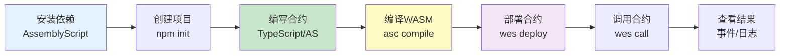
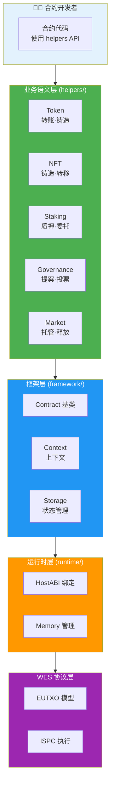
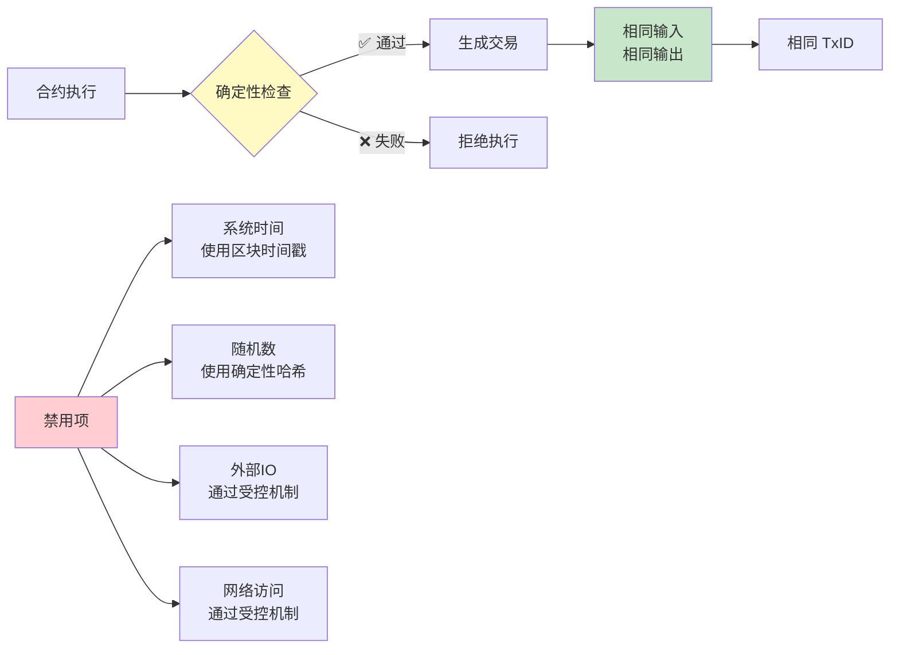

# WES 合约开发指南（TypeScript/AssemblyScript）

**版本**: v0.1.0-alpha  
**状态**: ✅ 稳定  
**最后更新**: 2025-11-11

---

## 📋 概述

本指南介绍如何使用 WES Contract SDK JS 编写 TypeScript/AssemblyScript 智能合约，从模板创建到部署上链的完整开发流水线。

---

## 🚀 快速开始

### 开发流程概览



### 1. 安装依赖

```bash
# 安装 AssemblyScript
npm install -g assemblyscript

# 验证安装
asc --version
```

### 2. 创建新合约

#### 方式1：使用模板（推荐）

```bash
# 复制学习模板
cp -r node_modules/@weisyn/contract-sdk-js/templates/learning/hello-world my-contract
cd my-contract
```

#### 方式2：从零开始

```bash
# 创建项目目录
mkdir my-contract
cd my-contract

# 初始化 npm 项目
npm init -y

# 安装 SDK
npm install @weisyn/contract-sdk-js

# 安装 AssemblyScript 开发依赖
npm install --save-dev assemblyscript
```

### 3. 编写合约

创建 `contract.ts`：

```typescript
import { Contract, Context, ErrorCode } from '@weisyn/contract-sdk-js/as';
import { Token } from '@weisyn/contract-sdk-js/helpers';

@contract('MyToken')
export class MyTokenContract extends Contract {
  onInit(params: Uint8Array): ErrorCode {
    // 合约初始化逻辑
    return ErrorCode.SUCCESS;
  }
  
  @call('Transfer')
  transfer(): ErrorCode {
    // 获取参数
    const params = Context.getContractParams();
    const toStr = params.parseJSON('to');
    const amount = params.parseJSONInt('amount');
    
    // 解析地址
    const to = Context.parseAddressBase58(toStr);
    if (to === null) {
      return ErrorCode.ERROR_INVALID_PARAMS;
    }
    
    // 使用业务语义接口进行转账
    const caller = Context.getCaller();
    const result = Token.transfer(caller, to, amount, null);
    if (result !== ErrorCode.SUCCESS) {
      return ErrorCode.ERROR_EXECUTION_FAILED;
    }
    
    return ErrorCode.SUCCESS;
  }
}
```

### 4. 编译合约

```bash
# 使用 AssemblyScript 编译器
asc contract.ts \
  --target release \
  --outFile contract.wasm \
  --optimize \
  --noAssert
```

**编译选项说明**：
- `--target release`: 发布模式，优化代码大小和执行速度
- `--optimize`: 启用优化
- `--noAssert`: 移除断言检查（生产环境）

### 5. 部署合约

```bash
# 使用 WES CLI 部署
wes contract deploy \
  --wasm contract.wasm \
  --name "MyToken" \
  --init-params '{}'
```

### 6. 调用合约

```bash
# 调用 Transfer 函数
wes contract call \
  --contract <合约地址> \
  --function Transfer \
  --params '{"to":"<接收者地址>","amount":1000}'
```

### 7. 查看日志和事件

```bash
# 查看合约执行日志
wes contract logs --contract <合约地址>

# 查看合约事件
wes contract events --contract <合约地址> --event Transfer
```

---

## 📚 核心概念

### SDK 分层架构

合约开发者只需关注业务语义层，SDK 自动处理底层细节：



### 1. 业务语义优先

**推荐使用 Helpers 层的业务语义接口**：

```typescript
import { Token } from '@weisyn/contract-sdk-js/helpers';
import { NFT } from '@weisyn/contract-sdk-js/helpers';
import { Staking } from '@weisyn/contract-sdk-js/helpers';

// 转账
const result = Token.transfer(from, to, amount, tokenID);

// 铸造NFT
const result = NFT.mint(to, tokenID, metadata);

// 质押
const result = Staking.stake(staker, validator, amount);
```

**优势**：
- 代码更简洁直观
- 自动处理余额检查、交易构建等
- 类型安全

### 2. 确定性保证

所有交易构建都是确定性的：



**确定性要求**：
- ✅ 禁用系统时间（使用区块时间戳）
- ✅ 禁用随机数（使用确定性哈希）
- ✅ 禁用外部IO（通过受控机制）
- ✅ 禁用网络访问（通过受控机制）

**验证方法**：100次重复执行产生相同TxID

### 3. 错误处理

```typescript
const result = Token.transfer(from, to, amount, tokenID);
if (result !== ErrorCode.SUCCESS) {
  switch (result) {
    case ErrorCode.ERROR_INSUFFICIENT_BALANCE:
      // 余额不足
      HostABI.logDebug('Insufficient balance');
      break;
    case ErrorCode.ERROR_INVALID_PARAMS:
      // 参数无效
      HostABI.logDebug('Invalid parameters');
      break;
    default:
      // 其他错误
      HostABI.logDebug('Execution failed');
  }
  return result;
}
```

---

## 🎯 常见场景

### 场景1：简单转账

```typescript
import { Token } from '@weisyn/contract-sdk-js/helpers';
import { Context, ErrorCode } from '@weisyn/contract-sdk-js/as';

@call('Transfer')
transfer(): ErrorCode {
  const params = Context.getContractParams();
  const toStr = params.parseJSON('to');
  const amount = params.parseJSONInt('amount');
  
  const to = Context.parseAddressBase58(toStr);
  if (to === null) {
    return ErrorCode.ERROR_INVALID_PARAMS;
  }
  
  const caller = Context.getCaller();
  return Token.transfer(caller, to, amount, null);
}
```

### 场景2：批量转账

```typescript
import { Token } from '@weisyn/contract-sdk-js/helpers';
import { Context, ErrorCode } from '@weisyn/contract-sdk-js/as';

@call('BatchTransfer')
batchTransfer(): ErrorCode {
  const params = Context.getContractParams();
  const recipients = params.parseJSONArray('recipients');
  const amounts = params.parseJSONIntArray('amounts');
  
  if (recipients.length !== amounts.length) {
    return ErrorCode.ERROR_INVALID_PARAMS;
  }
  
  const caller = Context.getCaller();
  for (let i = 0; i < recipients.length; i++) {
    const to = Context.parseAddressBase58(recipients[i]);
    if (to === null) {
      return ErrorCode.ERROR_INVALID_PARAMS;
    }
    
    const result = Token.transfer(caller, to, amounts[i], null);
    if (result !== ErrorCode.SUCCESS) {
      return result;
    }
  }
  
  return ErrorCode.SUCCESS;
}
```

### 场景3：NFT 铸造

```typescript
import { NFT } from '@weisyn/contract-sdk-js/helpers';
import { Context, ErrorCode } from '@weisyn/contract-sdk-js/as';

@call('MintNFT')
mintNFT(): ErrorCode {
  const params = Context.getContractParams();
  const toStr = params.parseJSON('to');
  const tokenID = params.parseJSON('token_id');
  const metadataStr = params.parseJSON('metadata');
  
  const to = Context.parseAddressBase58(toStr);
  if (to === null) {
    return ErrorCode.ERROR_INVALID_PARAMS;
  }
  
  const metadata = String.UTF8.encode(metadataStr);
  return NFT.mint(to, tokenID, metadata);
}
```

---

## 🔧 开发工具链

### 1. 模板创建

```bash
# 使用学习模板
cp -r node_modules/@weisyn/contract-sdk-js/templates/learning/simple-token my-token

# 使用标准模板
cp -r node_modules/@weisyn/contract-sdk-js/templates/standard/token/erc20-token my-erc20
```

### 2. 编译配置

创建 `asconfig.json`：

```json
{
  "targets": {
    "release": {
      "binaryFile": "build/contract.wasm",
      "textFile": "build/contract.wat",
      "optimizeLevel": 3,
      "shrinkLevel": 2,
      "converge": false,
      "noAssert": true
    },
    "debug": {
      "binaryFile": "build/contract.debug.wasm",
      "textFile": "build/contract.debug.wat",
      "sourceMap": true,
      "debug": true
    }
  },
  "options": {
    "bindings": "esm"
  }
}
```

### 3. 本地测试

```bash
# 使用本地 WASM runner 测试
npm install --save-dev @weisyn/wasm-runner
wasm-runner contract.wasm --function Transfer --params '{"to":"...","amount":1000}'
```

### 4. 调试技巧

```typescript
import { HostABI } from '@weisyn/contract-sdk-js/runtime';

// 记录调试日志
HostABI.logDebug('Processing transfer...');
HostABI.logDebug(`From: ${from}, To: ${to}, Amount: ${amount}`);

// 发出事件（可用于调试）
HostABI.emitEvent(JSON.stringify({
  name: 'Debug',
  message: 'Transfer completed',
  amount: amount.toString()
}));
```

---

## 📖 完整开发流水线

### 1. 模板创建

```bash
# 选择模板
cp -r templates/learning/simple-token my-contract
cd my-contract
```

### 2. 编写合约代码

编辑 `contract.ts`，使用 Helpers 层 API 实现业务逻辑。

### 3. 编译 WASM

```bash
# 开发模式（带调试信息）
asc contract.ts --target debug --outFile contract.debug.wasm

# 发布模式（优化）
asc contract.ts --target release --outFile contract.wasm
```

### 4. 本地测试

```bash
# 使用本地 runner 测试
wasm-runner contract.wasm --function <函数名> --params '<JSON参数>'
```

### 5. 部署到链上

```bash
# 部署合约
wes contract deploy --wasm contract.wasm --name "MyContract"

# 获取合约地址
CONTRACT_ADDR=$(wes contract deploy --wasm contract.wasm --name "MyContract" | grep "Contract Address" | awk '{print $3}')
```

### 6. 调用合约

```bash
# 调用合约函数
wes contract call \
  --contract $CONTRACT_ADDR \
  --function Transfer \
  --params '{"to":"<地址>","amount":1000}'
```

### 7. 查看日志和事件

```bash
# 查看执行日志
wes contract logs --contract $CONTRACT_ADDR --limit 10

# 查看事件
wes contract events --contract $CONTRACT_ADDR --event Transfer

# 查看特定交易的事件
wes tx events --tx <交易哈希>
```

---

## ⚠️ 注意事项

### AssemblyScript 限制

- ❌ **不支持联合类型**：使用枚举或接口替代
- ❌ **不支持可选属性**：使用 `| null` 或默认值
- ❌ **字符串操作受限**：使用 `String.UTF8` 进行编码/解码
- ❌ **不支持动态导入**：所有导入必须在编译时确定

详见：[AssemblyScript 兼容性指南](./ASSEMBLYSCRIPT_COMPATIBILITY.md)

### 最佳实践

1. **优先使用 Helpers 层**：避免直接使用 Framework 层的 TransactionBuilder
2. **类型安全**：使用 SDK 提供的类型（`Address`, `Amount`, `TokenID` 等）
3. **错误处理**：使用统一的错误码，便于错误处理和调试
4. **事件和日志**：合理使用事件和日志，避免过度使用影响性能
5. **地址编码**：使用 Base58 编码（与 Go SDK 保持一致）

---

## 🔗 相关文档

- [API 参考](./API_REFERENCE.md) - 完整 API 文档
- [架构设计](./ARCHITECTURE.md) - 整体架构说明
- [AssemblyScript 兼容性指南](./ASSEMBLYSCRIPT_COMPATIBILITY.md) - AssemblyScript 限制和最佳实践
- [合约模板](../templates/README.md) - SDK 提供的合约开发模板

---

**最后更新**: 2025-11-11
