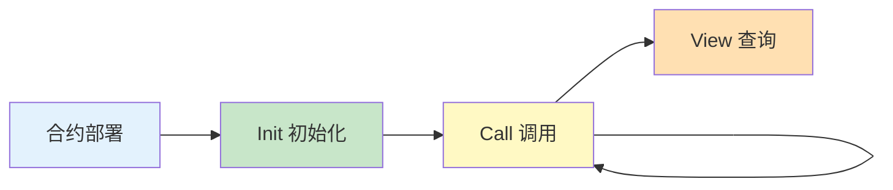
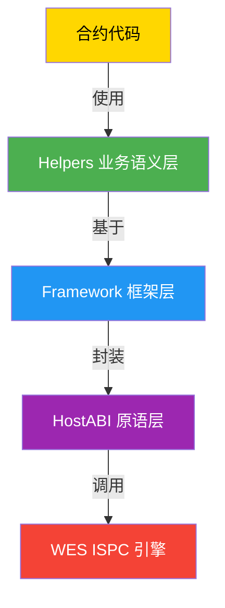

# WES 合约开发指南 - JS SDK 视角

**版本**: v1.0.0  
**最后更新**: 2025-01-23

---

## 📋 文档定位

> 📌 **重要说明**：本文档聚焦 **JS SDK 视角**的合约开发指南。  
> 如需了解 WES 平台的核心概念、架构设计、ISPC 原理等，请参考主仓库文档。

**本文档目标**：
- 说明如何使用 JS SDK 开发 WES 智能合约
- 讲解常见开发模式（参数解析、错误处理、事件、调用外部 API 等）
- 提供从模板到部署的完整开发流程
- **引用平台文档**：平台概念（UTXO、ISPC 原理等）请参考主仓库文档

**前置阅读**（平台级文档，来自主仓库）：
- [智能合约平台文档](../../../weisyn.git/docs/system/platforms/contracts/README.md) - 智能合约平台总览
- [合约核心概念](../../../weisyn.git/docs/tutorials/contracts/CONCEPTS.md) - 核心概念解释
- [合约学习路径](../../../weisyn.git/docs/tutorials/contracts/LEARNING_PATH.md) - 分阶段学习路径

---

## 🚀 快速开始

### 前置要求

- **Node.js 20+** - 用于开发环境编译
- **TypeScript 5.0+, AssemblyScript 0.27+** - 用于编译为 WASM

```bash
# macOS
brew install tinygo

# Linux/其他
# 见 https://tinygo.org/getting-started/install/
```

### 安装 SDK

```bash
npm install @weisyn/contract-sdk-js@v1.0.0
```

### 第一个合约

创建 `hello.ts`:

```go
import

import (
    "@weisyn/contract-sdk-js/framework"
)

//export SayHello
func SayHello() uint32 {
    // 获取调用者地址
    caller := framework.GetCaller()
    
    // 发出事件
    message := "Hello, " + string(caller)
    framework.EmitEvent("Greeting", []byte(message))
    
    // 返回成功
    framework.SetReturnData([]byte(message))
    return framework.SUCCESS
}
```

编译为 WASM：

```bash
asc -o main.wasm -target wasm -no-debug hello.ts
```

---

## 📚 核心概念

### 合约生命周期



- **Init**：合约初始化，设置初始状态
- **Call**：合约调用，修改状态
- **View**：合约查询，只读操作

### SDK 分层架构



- **Helpers 层**：业务语义接口（`token.Transfer()`, `staking.Stake()` 等）
- **Framework 层**：HostABI 封装（环境查询、事件日志等）
- **HostABI 层**：17 个最小原语（由 ISPC 提供）

---

## 🎯 常见开发模式

### 参数解析

```go
import (
    "@weisyn/contract-sdk-js/framework"
    "@weisyn/contract-sdk-js/helpers/token"
)

//export Transfer
func Transfer() uint32 {
    // 获取调用参数
    params := framework.GetCallParams()
    
    // 解析参数（JSON 格式）
    // 注意：SDK 内部实现了轻量级 JSON 解析器
    // 仅支持基本字段提取
    
    // 使用 Helpers API（推荐）
    // token.Transfer 内部已经处理了参数解析
    return token.Transfer(params)
}
```

### 错误处理

```go
import (
    "@weisyn/contract-sdk-js/framework"
    "@weisyn/contract-sdk-js/helpers/token"
)

//export Transfer
func Transfer() uint32 {
    // Helpers API 内部已经处理了错误码映射
    // 返回标准错误码
    errCode := token.Transfer(params)
    if errCode != framework.SUCCESS {
        return errCode
    }
    
    return framework.SUCCESS
}
```

### 事件发出

```go
import "@weisyn/contract-sdk-js/framework"

//export Transfer
func Transfer() uint32 {
    // 发出事件
    framework.EmitEvent("Transfer", []byte("from:alice,to:bob,amount:100"))
    
    return framework.SUCCESS
}
```

### 外部 API 调用

```go
import "@weisyn/contract-sdk-js/helpers/external"

//export CallExternalAPI
func CallExternalAPI() uint32 {
    // 调用外部 API（受控外部交互）
    result, errCode := external.Call("https://api.example.com/data", nil)
    if errCode != framework.SUCCESS {
        return errCode
    }
    
    // 处理结果
    framework.SetReturnData(result)
    return framework.SUCCESS
}
```

---

## 🏗️ 开发流程

### 1. 选择模板

参考 [合约模板](../templates/README.md) 选择合适的模板：
- **学习模板**：hello-world、simple-token、basic-nft
- **标准业务模板**：token、staking、governance、market、nft、rwa、defi

### 2. 本地开发

```bash
# 克隆模板
cp -r templates/learning/hello-world my-contract
cd my-contract

# 修改代码
# ...

# 编译
./build.sh
```

### 3. 测试

```bash
# 运行测试
go test ./...

# 或使用 Workbench 进行集成测试
# 参考：主仓库集成测试指南
```

### 4. 部署

使用 Workbench 或 Client SDK 部署合约。

---

## 📖 进一步阅读

### 核心文档

- **[API 参考](./API_REFERENCE.md)** - 详细的 API 文档
- **[业务场景实现指南](./BUSINESS_SCENARIOS.md)** - 如何实现业务场景
- **[语言与 WASM 限制](./LANGUAGE_AND_WASM_LIMITATIONS.md)** - Typescript/AssemblyScript/TinyTypescript/AssemblyScript 限制和注意事项
- **[WES Error Spec 实施](./WES_ERROR_SPEC_IMPLEMENTATION.md)** - 错误处理规范

### 模块文档

- **[Helpers 层文档](../helpers/README.md)** - 业务语义层详细说明
- **[Framework 层文档](../framework/README.md)** - 框架层详细说明
- **[合约模板](../templates/README.md)** - SDK 提供的合约开发模板

### 平台文档（主仓库）

- [智能合约平台文档](../../../weisyn.git/docs/system/platforms/contracts/README.md) - 平台总览
- [合约教程](../../../weisyn.git/docs/tutorials/contracts/CONCEPTS.md) - 合约开发教程
- [WASM 环境说明](../../../weisyn.git/docs/tutorials/contracts/wasm-environment.md) - WASM 环境详解

---

**最后更新**: 2025-01-23  
**维护者**: WES Core Team

