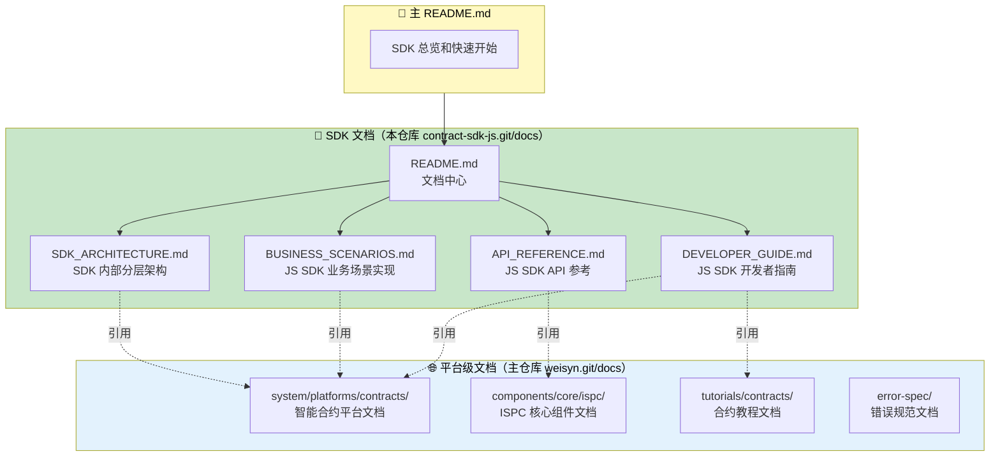
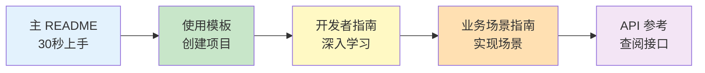
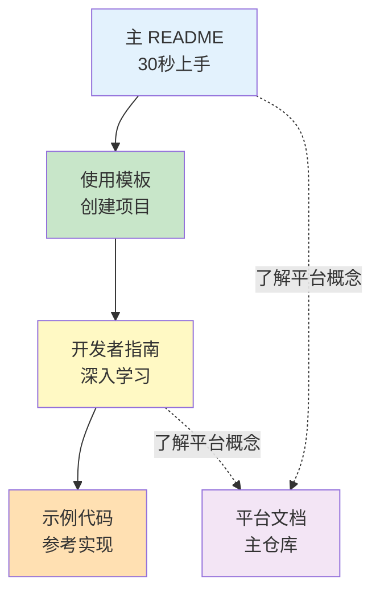
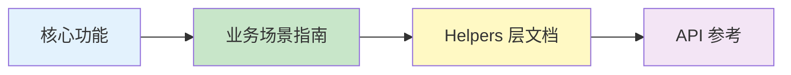
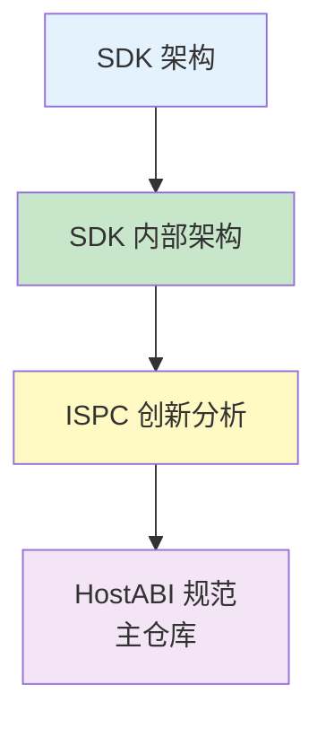

# Contract SDK JS - 文档中心

**版本**: v1.0.0  
**最后更新**: 2025-01-23

---

## 📚 文档导航中心

**按角色快速找到你需要的文档**

[👨‍💻 合约开发者](#-合约开发者) • [🏗️ 架构师/贡献者](#️-架构师贡献者) • [📖 参考文档](#-参考文档)

---

## 📋 文档定位说明

### 文档层次关系

**核心原则**：
- ✅ **平台级文档**（`weisyn.git/docs`）：系统级、平台级、规范级的权威说明
- ✅ **SDK 文档**（`contract-sdk-js.git/docs`）：JS SDK 这一层的解读、对接与示例
- ✅ **引用关系**：SDK 文档引用平台文档，避免重复，保持一致性

**主 README.md** 的定位：
- ✅ **用户友好的入口**：快速了解 SDK，30秒上手
- ✅ **核心价值展示**：突出 SDK 的核心能力和优势
- ✅ **简洁的架构说明**：分层架构的概览
- ✅ **文档导航入口**：指向文档中心（本文件）

**docs/README.md**（本文件）的定位：
- ✅ **SDK 文档索引中心**：列出所有 SDK 相关文档及其定位
- ✅ **平台文档索引**：指向主仓库的平台级文档（只读、权威版本）
- ✅ **按角色导航**：为不同角色提供快速导航路径
- ✅ **文档分类**：按用户文档、设计文档、参考文档分类
- ✅ **使用建议**：为不同场景提供文档使用建议

---

## 👨‍💻 合约开发者

### 🚀 快速开始路径

**推荐路径**：
1. **[主 README](../README.md)** - 了解 SDK 是什么，30秒上手
2. **[合约模板](../templates/README.md)** - 使用模板快速创建项目
3. **[开发者指南](./DEVELOPER_GUIDE.md)** - 深入学习核心概念和开发模式
4. **[业务场景实现指南](./BUSINESS_SCENARIOS.md)** - 学习如何实现业务场景
5. **[API 参考](./API_REFERENCE.md)** - 查阅详细的 API 文档

### 📖 核心文档

#### 必读文档（P0）

- ⭐ **[主 README](../README.md)** - SDK 总览和 30 秒上手
  - SDK 简介和核心价值
  - 安装和第一个合约
  - 核心功能概览
  - **合约模板**：如何使用模板快速开始

- 📖 **[开发者指南](./DEVELOPER_GUIDE.md)** - 如何使用 TypeScript/AssemblyScript SDK 开发合约
  - JS SDK 安装与环境（Node.js/TypeScript/AssemblyScript）
  - 如何选择并使用 `templates/` 中的 TS/AS 模板
  - 与 Workbench（`model-workbench` / `contract-workbench`）的协作流程
  - 常见开发模式（参数解析、错误处理、事件、调用外部 API 等）
  - **引用平台文档**：平台概念（UTXO、ISPC 原理等）请参考主仓库文档

- 📚 **[API 参考](./API_REFERENCE.md)** - TypeScript/AssemblyScript SDK 接口详细说明
  - Framework 层 API（TypeScript/AssemblyScript 语言封装）
  - Helpers 层 API（业务语义接口）
  - 接口参数和返回值
  - 使用示例
  - **引用平台文档**：HostABI 原语能力请参考主仓库文档

#### 推荐文档（P1）

- 🎯 **[业务场景实现指南](./BUSINESS_SCENARIOS.md)** - 如何使用 JS SDK 实现业务场景
  - 每个场景前半部分：链接到主仓库对应场景文档
  - 每个场景后半部分：JS SDK 版本的实现建议 + 模板指引 + 关键 API
  - 电商、制造业、DeFi、NFT 等场景

- 🔧 **[Helpers 层文档](../helpers/README.md)** - 业务语义层详细说明
  - Token、Staking、Governance、Market、RWA、External 模块
  - 各模块 API 和使用示例（TypeScript/AssemblyScript 语言）

- 💡 **[合约模板](../templates/README.md)** - SDK 提供的合约开发模板
  - 学习模板（hello-world、simple-token、basic-nft）
  - 标准业务模板（token、staking、governance、market、nft、rwa、defi）

#### 可选文档（P2）

- 🏗️ **[Framework 层文档](../framework/README.md)** - 框架层详细说明
  - HostABI 封装（TypeScript/AssemblyScript 语言实现）
  - 环境查询、事件日志
  - 交易构建（内部实现）

- ⚠️ **[语言与 WASM 限制](./LANGUAGE_AND_WASM_LIMITATIONS.md)** - TypeScript/AssemblyScript 特有的限制和注意事项
  - AssemblyScript 支持矩阵
  - JSON/Date/Math.random 等限制
  - 编译参数和优化建议

---

## 🏗️ 架构师/贡献者

### 架构设计文档

#### 核心设计文档（P1）

- 🏗️ **[SDK 内部架构](./SDK_ARCHITECTURE.md)** - SDK 内部分层架构设计
  - **聚焦 SDK 自身**：helpers 分层、framework 层设计
  - **引用平台架构**：WES 7 层架构请参考主仓库文档
  - 模块组织方式、依赖关系说明、设计决策记录

- 📊 **[应用场景分析](./APPLICATION_SCENARIOS_ANALYSIS.md)** - SDK 职责边界分析
  - **聚焦 SDK 职责**：在某场景中，JS SDK 负责哪一段？
  - **引用平台场景**：详细业务流图、跨子系统交互请参考主仓库文档
  - SDK 与 Client SDK、Workbench、节点的职责划分

- 🔮 **[ISPC 创新分析](./ISPC_INNOVATION_ANALYSIS.md)** - JS SDK 如何使用 ISPC
  - **聚焦 SDK 集成**：对 TS/AS 合约开发者，ISPC 带来哪些能力
  - **引用平台文档**：ISPC 核心范式、受控外部交互机制请参考主仓库文档
  - 这些能力在 JS SDK 中分别由哪些 helpers / framework API 暴露
  - 典型"外部调用 + ZK / 证明"的开发模式

#### 规划文档（P2）

- 📈 **[架构规划](./ARCHITECTURE_PLAN.md)** - JS SDK 架构规划文档
  - **聚焦 SDK 自身**：JS SDK 未来演进方向（新增 helpers 模块、改进模板目录等）
  - **引用平台规划**：平台级 roadmap 请参考主仓库文档
  - 技术债务管理

- 📐 **[场景可视化指南](./SCENARIOS_VISUAL_GUIDE.md)** - SDK 相关的简明架构/场景图
  - SDK 内部分层架构图
  - SDK 与平台其他组件的交互图
  - **引用平台文档**：详细业务流图请参考主仓库文档

---

## 📖 参考文档

### SDK 参考文档（本仓库）

- ⚠️ **[语言与 WASM 限制](./LANGUAGE_AND_WASM_LIMITATIONS.md)** - TypeScript/AssemblyScript 特有的限制和注意事项
  - AssemblyScript 支持矩阵
  - JSON/Date/Math.random 等限制
  - 编译参数和优化建议
  - 禁止使用的标准库

- 🔧 **[WES Error Spec 实施](./WES_ERROR_SPEC_IMPLEMENTATION.md)** - JS SDK 如何对接错误规范
  - 错误码映射
  - 错误处理模式
  - **引用平台文档**：WES Error Specification 请参考主仓库文档

- 📋 **[文档体系说明](./DOCUMENTATION_STRUCTURE.md)** - 文档体系与分层说明
  - SDK 文档与平台文档的关系
  - 文档组织结构
  - 与根 README 的映射关系

### 平台参考文档（主仓库）

以下文档来自 `weisyn.git/docs`，是平台级参考文档的权威版本：

- 📘 **[HostABI 规范](../../../weisyn.git/docs/components/core/ispc/capabilities/hostabi-primitives.md)** - HostABI 原语能力
- 🔗 **[接口映射](../../../weisyn.git/docs/reference/contracts/pkg-interfaces-to-hostabi-mapping.md)** - pkg/interfaces 到 Host ABI 映射
- 🔧 **[工具链版本矩阵](../../../weisyn.git/docs/reference/contracts/toolchain-version-matrix.md)** - 工具链版本要求
- 🧪 **[集成测试指南](../../../weisyn.git/docs/tutorials/contracts/integration-testing.md)** - 合约集成测试
- 🌐 **[WASM 环境说明](../../../weisyn.git/docs/tutorials/contracts/wasm-environment.md)** - WASM 环境详解

---

## 🎯 快速导航路径

### 新手入门路径

1. **[主 README](../README.md)** - 了解 SDK 是什么，30秒上手
2. **[合约模板](../templates/README.md)** - 使用模板快速创建项目
3. **[开发者指南](./DEVELOPER_GUIDE.md)** - 深入学习核心概念
4. **[示例代码](../templates/README.md)** - 参考实际应用示例
5. **平台文档**（主仓库）- 如需了解平台概念，参考平台文档

### 功能开发路径

1. **[核心功能](../README.md#-核心能力)** - 了解 SDK 提供的功能
2. **[业务场景实现指南](./BUSINESS_SCENARIOS.md)** - 学习如何实现业务场景
3. **[Helpers 层文档](../helpers/README.md)** - 查看业务语义接口说明
4. **[API 参考](./API_REFERENCE.md)** - 查阅详细的 API 文档

### 深入理解路径

1. **[SDK 架构](../README.md#-架构概览)** - 理解分层架构
2. **[SDK 内部架构](./SDK_ARCHITECTURE.md)** - 了解架构设计决策
3. **[ISPC 创新分析](./ISPC_INNOVATION_ANALYSIS.md)** - 理解 JS SDK 如何使用 ISPC
4. **[HostABI 规范](../../../weisyn.git/docs/components/core/ispc/capabilities/hostabi-primitives.md)** - 深入底层能力（主仓库）

---

## 📋 文档分类

### 用户文档（面向合约开发者）

| 文档 | 说明 | 优先级 |
|------|------|--------|
| ⭐ [主 README](../README.md) | SDK 总览和快速开始 | P0 |
| 📖 [开发者指南](./DEVELOPER_GUIDE.md) | 如何使用 JS SDK 开发合约 | P0 |
| 📚 [API 参考](./API_REFERENCE.md) | JS SDK 接口详细说明 | P0 |
| 🎯 [业务场景实现指南](./BUSINESS_SCENARIOS.md) | 如何用 JS SDK 实现业务场景 | P1 |
| 🔧 [Helpers 层文档](../helpers/README.md) | 业务语义层详细说明 | P1 |
| 🏗️ [Framework 层文档](../framework/README.md) | 框架层详细说明 | P2 |
| 💡 [合约模板](../templates/README.md) | SDK 提供的合约开发模板 | P1 |

### 设计文档（面向架构师和贡献者）

| 文档 | 说明 | 优先级 |
|------|------|--------|
| 🏗️ [SDK 内部架构](./SDK_ARCHITECTURE.md) | SDK 内部分层架构设计 | P1 |
| 📊 [应用场景分析](./APPLICATION_SCENARIOS_ANALYSIS.md) | SDK 职责边界分析 | P1 |
| 📈 [架构规划](./ARCHITECTURE_PLAN.md) | JS SDK 架构规划文档 | P2 |
| 🔮 [ISPC 创新分析](./ISPC_INNOVATION_ANALYSIS.md) | JS SDK 如何使用 ISPC | P1 |
| 📐 [场景可视化指南](./SCENARIOS_VISUAL_GUIDE.md) | SDK 相关的简明架构图 | P2 |

### 参考文档（面向高级开发者）

| 文档 | 说明 | 来源 |
|------|------|------|
| ⚠️ [语言与 WASM 限制](./LANGUAGE_AND_WASM_LIMITATIONS.md) | TS/AS 限制和注意事项 | SDK 文档 |
| 🔧 [WES Error Spec 实施](./WES_ERROR_SPEC_IMPLEMENTATION.md) | JS SDK 如何对接错误规范 | SDK 文档 |
| 📋 [文档体系说明](./DOCUMENTATION_STRUCTURE.md) | 文档体系与分层说明 | SDK 文档 |
| 📘 [HostABI 规范](../../../weisyn.git/docs/components/core/ispc/capabilities/hostabi-primitives.md) | HostABI 原语能力 | 主仓库 |
| 🔗 [接口映射](../../../weisyn.git/docs/reference/contracts/pkg-interfaces-to-hostabi-mapping.md) | pkg/interfaces 到 Host ABI 映射 | 主仓库 |
| 🔧 [工具链版本矩阵](../../../weisyn.git/docs/reference/contracts/toolchain-version-matrix.md) | 工具链版本要求 | 主仓库 |
| 🧪 [集成测试指南](../../../weisyn.git/docs/tutorials/contracts/integration-testing.md) | 合约集成测试 | 主仓库 |
| 🌐 [WASM 环境说明](../../../weisyn.git/docs/tutorials/contracts/wasm-environment.md) | WASM 环境详解 | 主仓库 |

---

## 💡 文档使用建议

### 如果你是新手

1. **先看主 README**：了解 SDK 是什么，完成 30 秒上手
2. **使用模板创建项目**：通过模板快速开始，理解基本概念
3. **阅读开发者指南**：深入学习核心概念和最佳实践
4. **参考示例代码**：学习实际应用示例
5. **查阅平台文档**（主仓库）：如需了解平台概念（UTXO、ISPC 原理等）

### 如果你在开发功能

1. **查看核心功能**：了解 SDK 提供的功能
2. **查阅 API 参考**：查找具体的 API 使用方法
3. **参考业务场景指南**：学习如何实现业务场景
4. **查看模块文档**：深入了解特定模块
5. **查阅平台文档**（主仓库）：如需了解平台级场景和用例

### 如果你想贡献代码

1. **阅读架构设计文档**：理解 SDK 的整体架构
2. **查看应用场景分析**：理解 SDK 的职责边界
3. **参考架构规划**：了解未来演进方向
4. **阅读 HostABI 规范**（主仓库）：深入理解底层能力

---

## 🔗 相关链接

### WES 平台资源

- [WES 主项目](https://github.com/weisyn/weisyn) - WES 区块链主仓库
- [WES 文档中心](../../../weisyn.git/docs/) - 完整技术文档
- [WES 系统架构](../../../weisyn.git/docs/system/architecture/) - 系统架构详解
- [WES 主 README](../../../weisyn.git/README.md) - WES 项目总览

### SDK 相关资源

- [Contract SDK JS](../README.md) - TypeScript/AssemblyScript 合约 SDK 主 README
- [Contract SDK Go](../../contract-sdk-go.git/README.md) - Go 合约 SDK
- [Client SDK Go](../../client-sdk-go.git/README.md) - Go 客户端 SDK
- [Model Workbench](../../workbench/model-workbench.git/README.md) - 模型工作台

---

**最后更新**: 2025-01-23  
**维护者**: WES Core Team

