# 基础质押合约示例

**分类**: Staking 质押示例  
**难度**: ⭐⭐⭐ 高级  
**最后更新**: 2025-11-23

---

## 📋 概述

本示例展示如何使用 WES Contract SDK JS 构建质押和委托相关的智能合约。通过本示例，您可以学习如何使用 `helpers/staking` 模块提供的业务语义API，简化质押合约的开发。

---

## 🎯 核心功能

本示例实现了完整的质押和委托功能：

| 功能 | 函数 | 说明 |
|------|------|------|
| ✅ **质押** | `Stake` | 代币质押，自动处理余额检查和交易构建 |
| ✅ **解质押** | `Unstake` | 解质押代币，支持部分或全部解质押 |
| ✅ **委托** | `Delegate` | 将质押权委托给验证者 |
| ✅ **取消委托** | `Undelegate` | 取消委托，支持部分或全部取消委托 |

---

## 🏗️ 架构设计

```mermaid
graph TB
    A[合约调用者] -->|调用函数| B[合约函数]
    B -->|使用| C[helpers/staking]
    C -->|调用| D[framework层]
    D -->|HostABI| E[WES节点]
    
    C -->|自动处理| F[余额检查]
    C -->|自动处理| G[交易构建]
    C -->|自动处理| H[事件发出]
    
    style C fill:#e1f5ff
    style D fill:#fff4e1
    style E fill:#ffe1f5
```



**架构说明**：
- **合约层**：开发者编写的合约函数
- **Helpers层**：业务语义API，自动处理余额检查、交易构建、事件发出
- **Framework层**：HostABI封装，提供基础原语
- **节点层**：WES节点，执行合约并上链

---

## 📚 功能详解

### 1. Stake - 质押

**功能说明**：使用 `staking.Stake()` 进行代币质押。

**参数格式**：
```json
{
  "validator": "Cf1Kes6snEUeykiJJgrAtKPNPrAzPdPmSn",
  "amount": 10000
}
```

**SDK自动处理**：
- ✅ 余额检查（确保质押者余额充足）
- ✅ 交易构建（自动构建 UTXO 交易）
- ✅ 事件发出（自动发出 Stake 事件）

**⚠️ 注意**：实际应用中需要业务规则检查
- 验证者有效性检查（验证者是否在验证者列表中）
- 最小质押数量检查
- 锁定期检查（业务逻辑）

**使用示例**：
```bash
wes contract call --address {contract_addr} \
  --function Stake \
  --params '{"validator":"Cf1Kes6snEUeykiJJgrAtKPNPrAzPdPmSn","amount":10000}'
```

---

### 2. Unstake - 解质押

**功能说明**：使用 `staking.Unstake()` 解质押代币。

**参数格式**：
```json
{
  "validator": "Cf1Kes6snEUeykiJJgrAtKPNPrAzPdPmSn",
  "amount": 5000
}
```

**SDK自动处理**：
- ✅ 质押余额检查（确保有足够的质押余额）
- ✅ 交易构建（自动构建 UTXO 交易）
- ✅ 事件发出（自动发出 Unstake 事件）

**⚠️ 注意**：实际应用中需要业务规则检查
- 锁定期检查（是否满足解锁条件）
- 解质押冷却期检查

**使用示例**：
```bash
wes contract call --address {contract_addr} \
  --function Unstake \
  --params '{"validator":"Cf1Kes6snEUeykiJJgrAtKPNPrAzPdPmSn","amount":5000}'
```

---

### 3. Delegate - 委托质押

**功能说明**：使用 `staking.Delegate()` 将质押权委托给验证者。

**参数格式**：
```json
{
  "validator": "Cf1Kes6snEUeykiJJgrAtKPNPrAzPdPmSn",
  "amount": 5000
}
```

**使用示例**：
```bash
wes contract call --address {contract_addr} \
  --function Delegate \
  --params '{"validator":"Cf1Kes6snEUeykiJJgrAtKPNPrAzPdPmSn","amount":5000}'
```

---

### 4. Undelegate - 取消委托

**功能说明**：使用 `staking.Undelegate()` 取消委托。

**参数格式**：
```json
{
  "validator": "Cf1Kes6snEUeykiJJgrAtKPNPrAzPdPmSn",
  "amount": 5000
}
```

**使用示例**：
```bash
wes contract call --address {contract_addr} \
  --function Undelegate \
  --params '{"validator":"Cf1Kes6snEUeykiJJgrAtKPNPrAzPdPmSn","amount":5000}'
```

---

## 🚀 快速开始

### 1. 编译合约

```bash
cd templates/standard/staking/basic-staking
asc contract.ts --target release --outFile contract.wasm
```

### 2. 部署合约

```bash
wes contract deploy --wasm contract.wasm --function Initialize
```

### 3. 调用合约

```bash
# 质押代币
wes contract call --address {contract_addr} \
  --function Stake \
  --params '{"validator":"Cf1Kes6snEUeykiJJgrAtKPNPrAzPdPmSn","amount":10000}'

# 解质押代币
wes contract call --address {contract_addr} \
  --function Unstake \
  --params '{"validator":"Cf1Kes6snEUeykiJJgrAtKPNPrAzPdPmSn","amount":5000}'
```

---

## 📊 SDK vs 应用层职责

| 职责 | SDK 提供 | 应用层实现 |
|------|---------|-----------|
| **质押操作** | ✅ 自动处理 | - |
| **解质押操作** | ✅ 自动处理 | - |
| **委托操作** | ✅ 自动处理 | - |
| **验证者有效性** | ❌ | ✅ 需要实现 |
| **最小质押数量** | ❌ | ✅ 需要实现 |
| **锁定期检查** | ❌ | ✅ 需要实现 |
| **解质押冷却期** | ❌ | ✅ 需要实现 |

---

## 💡 设计理念

### 质押 vs 委托

| 特性 | 质押 | 委托 |
|------|------|------|
| **操作对象** | 验证者 | 验证者 |
| **所有权** | 质押者持有 | 委托者持有 |
| **收益分配** | 质押者获得 | 委托者和验证者分配 |
| **用途** | 直接参与验证 | 间接参与验证 |

### SDK 提供"积木"

SDK 提供基础能力（Stake、Unstake、Delegate、Undelegate），开发者可以：

- ✅ 直接使用基础功能创建质押合约
- ✅ 添加业务规则实现定制需求
- ✅ 组合多个功能实现复杂场景

### 应用层搭建"建筑"

应用层在 SDK 基础上实现：

- ✅ 验证者管理（验证者列表、有效性检查）
- ✅ 质押规则（最小质押数量、锁定期）
- ✅ 收益分配（质押奖励、委托奖励）

---

## 🔗 相关文档

- [Staking Helper 文档](../../../../docs/API_REFERENCE.md#staking) - Staking 模块详细说明
- [Framework 文档](../../../../_dev/FRAMEWORK_DESIGN.md) - Framework 层说明
- [示例总览](../README.md) - 所有示例索引

---

**最后更新**: 2025-11-23

