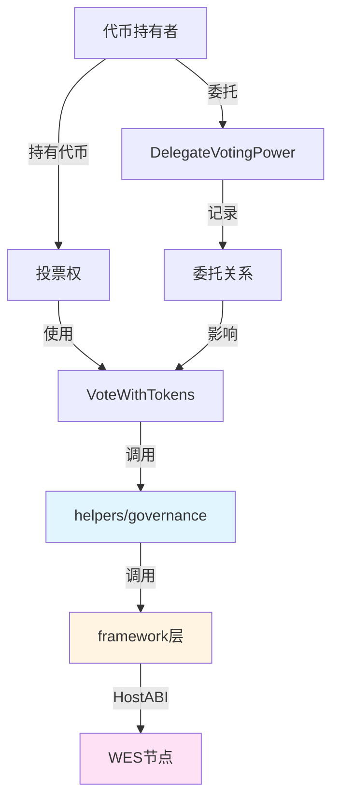

# 治理代币合约示例

**分类**: Token 代币示例  
**难度**: ⭐⭐ 进阶  
**最后更新**: 2025-01-23

---

## 📋 概述

本示例展示如何使用 WES Contract SDK JS 构建治理代币合约。治理代币是一种特殊的代币，持有者可以使用代币进行投票，参与去中心化治理。通过本示例，您可以学习如何将代币持有量与投票权关联，实现治理代币的铸造、转移、委托和投票功能。

---

## 🎯 核心功能

本示例实现了完整的治理代币功能：

| 功能 | 函数 | 说明 |
|------|------|------|
| ✅ **铸造代币** | `Mint` | 铸造治理代币，持有代币即拥有投票权 |
| ✅ **转移代币** | `Transfer` | 转移治理代币，投票权随之转移 |
| ✅ **委托投票权** | `DelegateVotingPower` | 将投票权委托给其他地址 |
| ✅ **使用代币投票** | `VoteWithTokens` | 使用治理代币进行投票，投票权重等于代币数量 |

---

## 🏗️ 架构设计



**架构说明**：
- **代币层**：使用 `helpers/token` 管理代币
- **治理层**：使用 `helpers/governance` 进行投票
- **Framework层**：HostABI封装，提供基础原语
- **节点层**：WES节点，执行合约并上链

---

## 📚 功能详解

### 1. Mint - 铸造治理代币

**功能说明**：使用 `token.Mint()` 铸造治理代币。

**参数格式**：
```json
{
  "to": "Cf1Kes6snEUeykiJJgrAtKPNPrAzPdPmSn",
  "amount": 1000
}
```

**特点**：
- 持有代币即拥有投票权
- 投票权重 = 持有的代币数量

**使用示例**：
```bash
wes contract call --address {contract_addr} \
  --function Mint \
  --params '{"to":"Cf1Kes6snEUeykiJJgrAtKPNPrAzPdPmSn","amount":1000}'
```

---

### 2. Transfer - 转移治理代币

**功能说明**：使用 `token.Transfer()` 转移治理代币。

**参数格式**：
```json
{
  "to": "Df2Lft7toFVfjlKKhsBtLQOQsQbQeRnTn",
  "amount": 100
}
```

**特点**：
- 转移代币时，投票权也随之转移
- 接收者获得投票权，发送者失去投票权

**使用示例**：
```bash
wes contract call --address {contract_addr} \
  --function Transfer \
  --params '{"to":"Df2Lft7toFVfjlKKhsBtLQOQsQbQeRnTn","amount":100}'
```

---

### 3. DelegateVotingPower - 委托投票权

**功能说明**：将投票权委托给其他地址。

**参数格式**：
```json
{
  "delegate": "Df2Lft7toFVfjlKKhsBtLQOQsQbQeRnTn",
  "amount": 500
}
```

**特点**：
- 委托后，被委托者可以使用委托的代币进行投票
- 委托者仍持有代币，但投票权由被委托者行使

**⚠️ 注意**：这是一个简化实现
- 实际应用中，应该使用状态输出存储委托关系
- 并在投票时检查委托的代币数量

**使用示例**：
```bash
wes contract call --address {contract_addr} \
  --function DelegateVotingPower \
  --params '{"delegate":"Df2Lft7toFVfjlKKhsBtLQOQsQbQeRnTn","amount":500}'
```

---

### 4. VoteWithTokens - 使用代币投票

**功能说明**：使用治理代币进行投票。

**参数格式**：
```json
{
  "proposal_id": "proposal_123",
  "support": true
}
```

**特点**：
- 投票权重 = 持有的代币数量 + 委托的代币数量
- 使用 `governance.Vote()` 进行投票

**⚠️ 注意**：这是一个简化实现
- 实际应用中，应该考虑委托的代币数量
- 投票权重 = 持有的代币数量 + 委托的代币数量

**使用示例**：
```bash
wes contract call --address {contract_addr} \
  --function VoteWithTokens \
  --params '{"proposal_id":"proposal_123","support":true}'
```

---

## 🚀 快速开始

### 1. 编译合约

```bash
cd templates/standard/token/governance-token
asc contract.ts --target release --outFile contract.wasm
```

编译完成后会生成 `contract.wasm` 文件。

### 2. 部署合约

```bash
# 使用 WES CLI 部署
wes contract deploy --wasm contract.wasm --function Initialize
```

### 3. 调用合约

```bash
# 铸造治理代币
wes contract call --address {contract_addr} \
  --function Mint \
  --params '{"to":"Cf1Kes6snEUeykiJJgrAtKPNPrAzPdPmSn","amount":1000}'

# 使用代币投票
wes contract call --address {contract_addr} \
  --function VoteWithTokens \
  --params '{"proposal_id":"proposal_123","support":true}'
```

---

## 📊 SDK vs 应用层职责

| 职责 | SDK 提供 | 应用层实现 |
|------|---------|-----------|
| **代币铸造** | ✅ 自动处理 | - |
| **代币转移** | ✅ 自动处理 | - |
| **投票操作** | ✅ 自动处理 | - |
| **委托关系管理** | ❌ | ✅ 需要实现（使用状态输出） |
| **投票权重计算** | ❌ | ✅ 需要实现（考虑委托） |
| **铸造权限** | ❌ | ✅ 需要实现 |

---

## 💡 设计理念

### 治理代币 vs 普通代币

| 特性 | 治理代币 | 普通代币 |
|------|---------|---------|
| **投票权** | ✅ 持有代币即拥有投票权 | ❌ 无投票权 |
| **投票权重** | 等于代币数量 | - |
| **委托** | ✅ 支持投票权委托 | ❌ 不支持 |
| **用途** | DAO治理、协议升级 | 支付、交易 |

### SDK 提供"积木"

SDK 提供基础能力（Mint、Transfer、Vote），开发者可以：

- ✅ 直接使用基础功能创建治理代币
- ✅ 添加业务规则实现定制需求
- ✅ 组合多个功能实现复杂场景

### 应用层搭建"建筑"

应用层在 SDK 基础上实现：

- ✅ 委托关系管理（使用状态输出存储）
- ✅ 投票权重计算（考虑委托的代币数量）
- ✅ 治理规则（提案创建、投票时间窗口等）

---

## 🔗 相关文档

- [Token Helper 文档](../../../../docs/API_REFERENCE.md#token) - Token 模块详细说明
- [Governance Helper 文档](../../../../docs/API_REFERENCE.md#governance) - Governance 模块详细说明
- [Framework 文档](../../../../_dev/FRAMEWORK_DESIGN.md) - Framework 层说明
- [示例总览](../README.md) - 所有示例索引

---

**最后更新**: 2025-01-23

